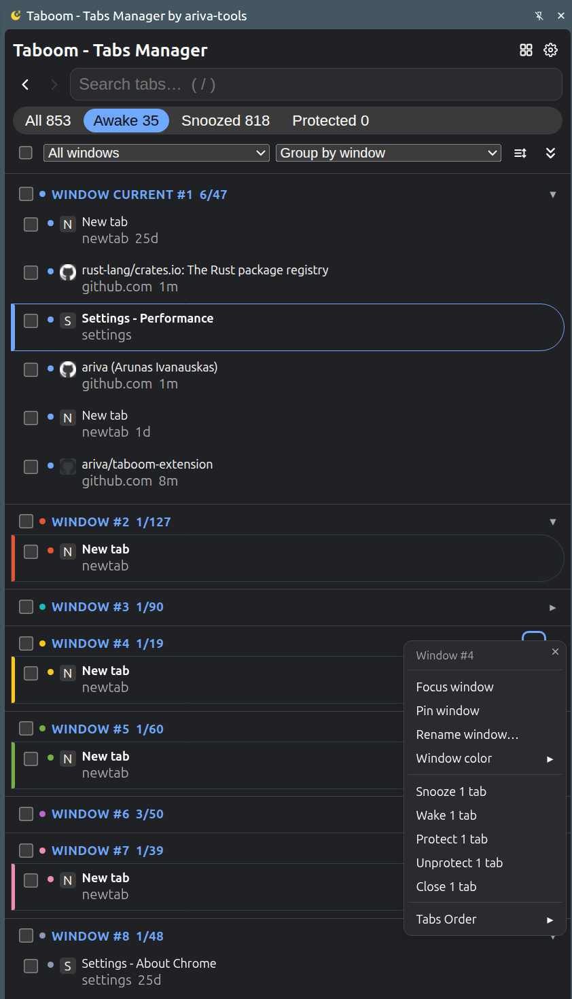
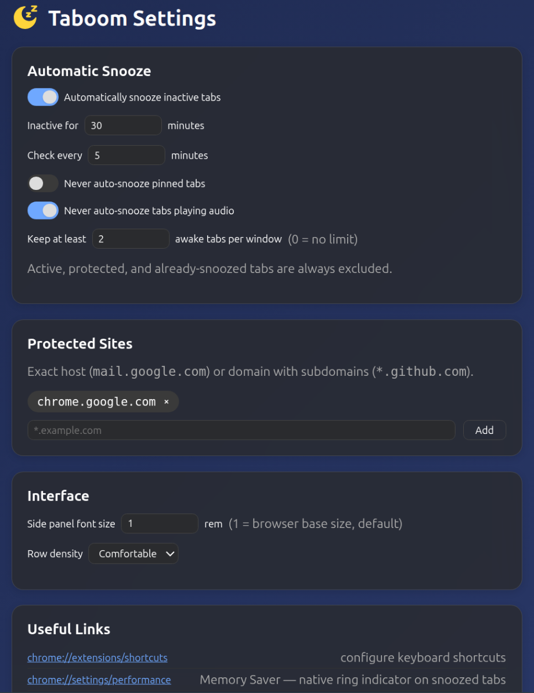

# Taboom - Tabs Manager - Chrome Extension

Search, protect, and snooze inactive Chrome tabs.

Taboom - Tabs Manager frees memory by snoozing (discarding) tabs you haven't used in a while — they stay in the tab strip and reload when clicked, nothing is ever closed automatically. A side panel lists all your tabs with instant search, filters, and bulk actions; sites that lose state on reload can be protected from snoozing. Plain JavaScript, no build step, runs fully locally with no telemetry.

## Installation

### Chrome Web Store
* **[Install from the Chrome Web Store](https://chromewebstore.google.com/detail/taboom-tabs-manager-by-ar/dllcchbdnomgagjlongoanjgolnjnegg?hl=en)**

### Local Installation
* Instructions: [docs/INSTALL.md](docs/INSTALL.md) — load unpacked in Chrome, requirements, troubleshooting

## Features

- **Side panel tab manager** — search across title/URL/hostname, filter by Awake / Snoozed / Protected, sort, and bulk snooze/protect/close.
- **Automatic snooze** — periodically discards tabs inactive past a configurable threshold, skipping pinned, audible, active, and protected tabs.
- **Site protection** — exclude sites (`mail.google.com`, `*.github.com`) from snoozing, also shielding them from Chrome's own Memory Saver.
- **Context menu and keyboard shortcuts** for quick per-tab actions.

## Privacy first

- Collects nothing, tracks nothing — your browsing is yours
- Everything stays on your device
- No accounts, no analytics, no servers
- Open source

## Permissions

Taboom is a privacy-first extension. It requests the bare minimum Chrome permissions it can function with — no host permissions, no `scripting`, no content scripts, and it makes zero network requests; everything runs locally, and it never has access to the content of the pages you browse.

| Permission | Why it's needed |
|---|---|
| `tabs` | List tabs (title/URL) in the side panel, snooze (discard), activate, and close them |
| `storage` | Save your settings and protection rules locally (`chrome.storage.local`) |
| `alarms` | Run the periodic automatic-snooze check (survives service-worker sleep) |
| `contextMenus` | Right-click menu: snooze this tab, protect this site |
| `sidePanel` | Show the tab manager in Chrome's side panel |
| `favicon` | Show tab favicons from Chrome's local cache — no request ever goes to the site |

Nothing else is requested: Taboom cannot read or modify page content, cannot see your browsing beyond open tabs' titles/URLs, and sends nothing anywhere.

## Screenshots

Side panel:

Options page:

## Documentation

- [Installation](docs/INSTALL.md) — load unpacked in Chrome, requirements, troubleshooting.
  After installing, pin the Taboom - Tabs Manager icon via Chrome's puzzle-piece (🧩) menu so the side panel is always one click away.
- [Usage](docs/USAGE.md) — concepts, side panel, automatic snooze, protection rules, verifying freed memory.
- [Testing](docs/TESTING.md) — setup (npm install, just, fd), running the suite, test layout and conventions.
