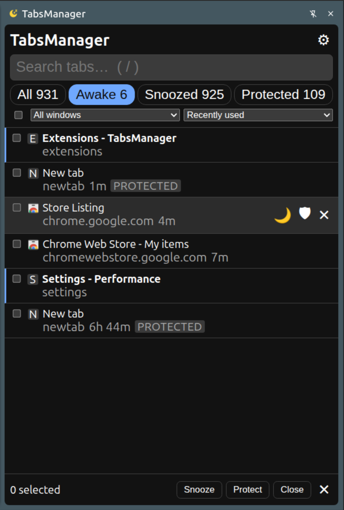
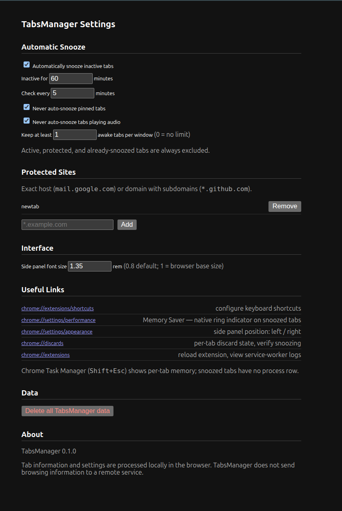

# Tabs Manager - Chrome Extension

Search, protect, and snooze inactive Chrome tabs.

TabsManager frees memory by snoozing (discarding) tabs you haven't used in a while — they stay in the tab strip and reload when clicked, nothing is ever closed automatically. A side panel lists all your tabs with instant search, filters, and bulk actions; sites that lose state on reload can be protected from snoozing. Plain JavaScript, no build step, runs fully locally with no telemetry.

## Features

- **Side panel tab manager** — search across title/URL/hostname, filter by Awake / Snoozed / Protected, sort, and bulk snooze/protect/close.
- **Automatic snooze** — periodically discards tabs inactive past a configurable threshold, skipping pinned, audible, active, and protected tabs.
- **Site protection** — exclude sites (`mail.google.com`, `*.github.com`) from snoozing, also shielding them from Chrome's own Memory Saver.
- **Popup, context menu, and keyboard shortcuts** for quick per-tab actions.

## Screenshots

Side panel:

Options page:

## Documentation

- [Installation](docs/INSTALL.md) — load unpacked in Chrome, requirements, troubleshooting.
- [Usage](docs/USAGE.md) — concepts, side panel, automatic snooze, protection rules, verifying freed memory.
