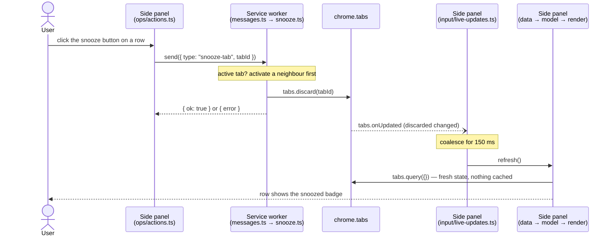

# Architecture

Taboom is a Manifest V3 Chrome extension written in strict TypeScript with vanilla DOM (no UI framework) and **no runtime dependencies**. [Vite](https://vite.dev) builds it into a plain, readable extension folder (`dist/prod`). Everything below points at code in this repository; when this page and the code disagree, the code wins.

Related docs: [INSTALL.md](INSTALL.md) (set up and load the extension) · [BUILD.md](BUILD.md) (build commands, release, minified build) · [TESTING.md](TESTING.md) (test tiers and layout) · [USAGE.md](USAGE.md) (what the extension does for a user).

## Layering — the one rule that shapes the tree

```text
src/lib/**         GENERIC — imports nothing from src/app, src/pages, src/background
tooling/**         GENERIC — Vite plugins, same rule
src/app/**         Taboom domain: pure logic (no DOM, no chrome.* calls) + the typed wiring of lib pieces
src/background/**  service worker: chrome.* effects, thin
src/pages/**       UI: DOM + chrome.* effects, thin; decisions live in pure model modules
```

Enforced mechanically, not by convention:

- `tests/structure/lib-boundary.test.ts` and the `noRestrictedImports` override in `biome.json` — generic code may not import Taboom code.
- `tests/structure/no-import-cycles.test.ts` — no runtime import cycles under `src/` or `tooling/`.
- `biome.json` `useBlockStatements` — braces on every `if`.

Working rules for new code: one file, one job (soft cap ~300 lines); decisions are pure functions, DOM / `chrome.*` code around them only reads inputs and applies results; every unit has its own test file in the matching `tests/` folder; module state has one owner and is exposed through functions, never an exported `let`.

## Runtime surfaces

| Surface | Entry | Role |
|---|---|---|
| Service worker | `src/background/service-worker.ts` | Registers every chrome event listener synchronously at module top level (MV3 requirement), in a fixed order, then delegates to feature modules. |
| Side panel | `src/pages/sidepanel/main.ts` + `src/pages/sidepanel/index.html` | Main UI. The entry only boots and calls `init*()` functions in listener-registration order. |
| Options page | `src/pages/options/main.ts` + `src/pages/options/index.html` | Settings, protected-site rules, What's new, performance panel, reset / delete. |

The manifest is code: `src/manifest.ts` exports `manifest(version, target = "chrome")`, emitted as `manifest.json` by the build. Permissions: `tabs`, `tabGroups`, `storage`, `alarms`, `contextMenus`, `sidePanel`, `favicon` — no host permissions, no content scripts. The extension makes **zero network requests**; `tests/e2e/smoke.spec.ts` asserts it on the built extension and `tests/structure/release-snapshot.test.ts` audits the release zip for network or dev-loop code.

## Service worker (`src/background/`)

| Module | Owns |
|---|---|
| `service-worker.ts` | entry: all listener registrations + boot, no logic |
| `lifecycle.ts` | coalesced init pass (`onInstalled` / `onStartup`), update-available note |
| `snooze.ts` | the alarm, the auto-snooze pass, manual snooze, wake-time recording |
| `protection.ts` | protection rules → `autoDiscardable`, toggle / bulk protect, protect menu sync |
| `keep-alive.ts` | keep-it-alive: one 30 s sweep alarm (armed only while enabled and marks exist) reloads due pages and re-arms them with ±55 s jitter; mark / unmark from menu and panel; checkbox menu item sync |
| `context-menus.ts` | browser context menu items, serialized rebuilds, history menu |
| `tab-history.ts` | tab activation history (back / forward / jump), persisted stack; `historyStep` serves both the panel's message and the browser-wide keyboard command; jumps start one at a time so Chrome's activation echo of a jump never lands behind the next jump (key auto-repeat) |
| `window-profiles.ts` | window identity across restarts, names / colors / pins, side-panel port tracking, panels to restore |
| `messages.ts` | `handleMessage`: exhaustive `switch` over the `Message` union |
| `gestures.ts` | keyboard commands and context-menu clicks |
| `nav-mode.ts` | cached feature flags and effective navigation mode |
| `storage-changes.ts` | reaction to `chrome.storage.onChanged` |

The worker is stateless across suspensions: everything is recoverable from storage plus the Tabs API, and alarms are recreated on startup.

## Side panel (`src/pages/sidepanel/`)

`main.ts`, `index.html` and `sidepanel.css` sit at the top; everything else is grouped by what it is for:

| Folder | Modules |
|---|---|
| `foundation/` | `state.ts` (the `PanelState` singleton and state-derived predicates), `elements.ts` (static DOM references), `scheduler.ts` (render / refresh registry), `perf.ts` |
| `model/` | pure view models — `index.ts` is the barrel over `derived.ts`, `search.ts`, `filters.ts`, `groups.ts`, `windows.ts`, `rows.ts`; plus `sort-direction.ts`, `window-order.ts`, `tab-hosts.ts` |
| `render/` | `data.ts` (tabs, groups, stored state, window meta → `state`), `sorting.ts`, `render.ts`, `headers.ts`, `row.ts`, `hover-tip.ts` |
| `ops/` | `actions.ts` (activate, snooze, wake, close, pin, protect domain / url, copy urls), `window-ops.ts`, `tab-group-ops.ts` |
| `menus/` | `menus.ts` (row / window / tab-group menus), `list-context-menu.ts` |
| `windows-popover/` | `popover.ts` (shell + Windows view), `groups.ts` (Groups view, new group, drag reorder), `pins.ts` |
| `dnd/` | `tab-dnd.ts`, `drop-target.ts`, and the pure `dnd-model.ts` (`dropSpecFor`, `reorderedGroupTitles`) |
| `history/` | `history-nav.ts` (back / forward buttons, history popover, long-press) |
| `banners/` | `update-banner.ts`, `restore-banner.ts` |
| `input/` | `list-events.ts`, `toolbar-events.ts`, `keyboard-nav.ts`, `global-keys.ts` (capture-phase Esc), `live-updates.ts` (chrome tab / storage events → debounced refresh) |

Dependency direction: `foundation` ← `model` ← `ops` ← `menus` ← `windows-popover` / `dnd` / `input` ← `main.ts`.

Two things worth knowing before changing this folder:

- **`foundation/scheduler.ts` inverts the render dependency.** Features call `render()` / `refresh()` through it and never import `render/render.ts` — that is what keeps the import graph acyclic. `main.ts` registers the real implementations first thing.
- **Listener order is behaviour.** Capture-phase Esc runs before the list's keydown; the context-menu hide runs before the popover click-away; blur handlers go dropdown → context menu → popovers. The order is fixed in exactly two places: the bare `src/lib/ui` imports at the top of `main.ts`, and the `init*()` call sequence below them.

`src/background/`, `src/pages/options/` and `src/app/` stay flat on purpose: each file there is already one feature, and a folder per file would add depth without adding structure.

## Options page (`src/pages/options/`)

`main.ts` (entry, `render()`), `page-state.ts` (feature flags, render forwarder, saved-flash), `settings-form.ts`, `ui-prefs.ts`, `rules.ts`, `keep-alive.ts` (Keep Tabs Alive card: numbered marks table with pause checkbox, per-mark interval, click-to-edit address, 1 s countdown, Remove, Add-by-address row, Clear all, Restore last removal), `whats-new.ts` (renders `CHANGES.md`), `perf-panel.ts`, `danger-zone.ts`, and the pure `model.ts` (release-notes parsing, perf formatting, zoom presets).

## Generic library (`src/lib/`)

| Module | What it is |
|---|---|
| `messaging.ts` | `createMessenger<Message, Responses>()` → typed `send()`. A message type without a response entry does not compile. |
| `storage.ts` | `createStorage<Schema>(area)` → typed `get` / `set` / `remove` over `chrome.storage[area]`. |
| `platform/capabilities.ts`, `platform/favicon.ts`, `platform/panel.ts` | The one browser-specific seam: feature detection, `_favicon/` URLs, side-panel open / toolbar behaviour. Chromium implementation only; app code asks for a capability, never for a browser name. |
| `ui/ask-dialog.ts` | confirm / prompt on the native `<dialog>` |
| `ui/inline-edit.ts` | label → input editing, including "the press that ends an edit only ends the edit" |
| `ui/context-menu.ts` | popover menu with hover-intent submenus |
| `ui/dropdown.ts` | custom select that positions inside a side panel |
| `ui/toast.ts` | transient message |
| `dom.ts` | `getElementById<T>`, `closest(eventTarget, selector)`, `mustQuery` |

Taboom binds these in `src/app/`: `messages.ts` (the `Message` union, `MessageResponses`, `send`), `storage.ts` (`localStore`, `sessionStore`, `loadState` / `saveState` with defaults merge), `types.ts` (domain types, `LocalStorageSchema`, `SessionStorageSchema`). The rest of `src/app/` is pure logic: `core.ts` (eligibility, rule matching, search helpers, defaults, feature flags), `keep-alive.ts` (keep-it-alive marks: list edits, jittered reload schedule), `window-identity.ts`, `protection-rules.ts`, `env.ts`.

## Data flow

In short:

```text
pages ── chrome.tabs.query({}) ──► live tab state (never cached or persisted)
pages ── send(Message) ──► service worker ──► tabs.discard / rules / window profiles / history
service worker ◄── chrome.alarms ──► auto-snooze pass
everything ◄── localStore / sessionStore ──► settings, rules, ui prefs, window profiles, tab history, perf, wake times
```

The diagram below shows the same flow. Read it from left to right: the user does something, Chrome's state changes, and the side panel reads that state again and displays it.

- Solid arrows are calls; dashed arrows are events.
- The side panel is drawn twice, once for the code that acts on user input and once for the code that displays tabs. These two parts never call each other — every change goes through Chrome, and the display side picks it up from there.

```mermaid
flowchart LR
  user([User acts])
  triggers["Chrome triggers<br/>alarms · commands · contextMenus"]
  options["Options page<br/>src/pages/options"]

  subgraph act["Side panel — acting"]
    ops["ops · menus · dnd<br/>windows-popover"]
  end

  subgraph worker["Service worker · src/background"]
    swMessages["messages.ts<br/>(exhaustive switch)"]
    swFeatures["snooze · protection<br/>tab-history · window-profiles"]
  end

  subgraph chrome["Chrome — the only source of truth"]
    tabsApi["tabs · tabGroups · windows"]
    storageApi[("storage.local<br/>storage.session")]
  end

  subgraph show["Side panel — showing"]
    live["input/live-updates.ts<br/>(150 ms debounce)"]
    pipeline["render/data.ts refresh()<br/>→ foundation/state.ts<br/>→ model/* (pure)<br/>→ render/*"]
  end

  screen([User sees])

  user -->|clicks, keys, drags| ops
  ops -->|"send(Message)"| swMessages
  swMessages --> swFeatures
  ops -->|"direct: activate, close,<br/>pin, move, group"| tabsApi
  triggers -.->|"onAlarm (auto-snooze)<br/>onCommand · onClicked"| swFeatures
  swFeatures -->|"discard<br/>autoDiscardable"| tabsApi
  swFeatures <-->|"rules · window profiles<br/>tab history · wake times"| storageApi
  options <-->|"settings · rules · ui prefs"| storageApi

  tabsApi -.->|"tab / group / window events"| live
  storageApi -.->|onChanged| live
  live -->|refresh| pipeline
  tabsApi -->|"query — live state,<br/>never cached"| pipeline
  storageApi -->|loadState| pipeline
  pipeline -->|DOM| screen
```



Not drawn, to keep it readable: the side panel also writes its own UI prefs to storage (`src/pages/sidepanel/input/toolbar-events.ts`), and it holds a `runtime.connect` port named `sidepanel:<windowId>` so the worker knows which windows have a panel open (`src/background/window-profiles.ts`, `src/pages/sidepanel/banners/restore-banner.ts`).

One round trip, end to end — the user snoozes a tab from the list:



The side panel never learns the result from the message reply — it re-reads Chrome. That is why the same path also covers tabs discarded by the auto-snooze alarm, by Chrome itself, or from another window's panel.

Design choices that matter:

- **No tab cache.** Every refresh re-queries Chrome; tab and storage events trigger a debounced refresh (`src/pages/sidepanel/input/live-updates.ts`).
- **`Tab.lastAccessed`** is the inactivity signal — no extension-side activity tracking.
- **Snoozing the active tab** activates a neighbour first: Chrome refuses to discard the active tab (`src/background/snooze.ts`).
- **Protection has two effects:** excluded from the auto-snooze pass, and `autoDiscardable: false` on matching tabs (`src/background/protection.ts`).
- **Keep-it-alive marks are keyed by url**, not tab id: ids do not survive a restart, and one mark covers every tab on that page. A mark made from a tab drops the fragment (`keepAliveKey`); one typed into Settings keeps it, because hash-routed apps differ only there — `matchesKeepAlive` in `core.ts` is the single rule (a mark with `#` is exact, one without covers every fragment) and every comparison (sweep, badge, menus, Alive view, unmark, snooze eligibility) goes through it. Each mark carries its own `minutes` (the default copied at mark time, so changing the default never silently reschedules old marks), an optional `paused` (absent = running; the mark is still a mark for the menu, the Alive view and snooze exclusion — only the sweep skips it) and its `nextReload`; toggling a mark's pause or re-enabling the feature restarts the schedule from now, so due times that passed meanwhile never fire together; a single 30 s sweep alarm (the MV3 floor) reloads the due ones and re-arms them at `interval ± 55 s`, floored to 30 s — a `periodInMinutes` alarm could not jitter — taking the first reloaded tab's title along so a mark's name follows the page (`setKeepAliveUrl` only renames hostname-titled marks, the Add row's placeholder). Kept pages are excluded from auto-snooze (manual snooze still works, as for protected) and carry a "kept alive" row badge (running marks only; paused ones show none, and the Alive view greys them out; that view lists every mark, open or not, striking through the ones with no open tab — `windows-popover/alive.ts`) derived once per refresh in `model/derived.ts`; the Settings Add row marks a typed address through `keepAliveUrlFromInput` (URL-normalized like a tab url, fragment kept) and the same `markKeepAlive` the menu uses; pause / resume and remove from both pages go through the writers `pauseKeepAlive` / `removeKeepAlive` in `src/app/storage.ts`; **every removal is undoable**: `removeKeepAlive` / `clearKeepAlive` (the worker's unmark included) push the dropped marks as one action onto `keepAliveTrash` (`{ at, marks }[]`, newest last, capped at 50 actions on write, no expiry), and `restoreKeepAlive` pops the newest, re-arming the returning marks from now and skipping pages marked again meanwhile (a not-open mark has no tab, so its menu — `openMarkMenu` — acts on the url); `autoDiscardable` is left alone because the next reload wakes a discarded tab anyway (`src/background/keep-alive.ts`, `src/app/keep-alive.ts`).
- **Feature flags** live in `features.json` (`enabled`, optional `experimental`); flag names are a type (`FeatureName` in `src/app/types.ts`), so a misspelled flag does not compile. A missing capability or a disabled flag hides the feature — the test suite runs every flag-dependent test with flags as shipped, with experimental flags on, and with everything off (`vitest.config.ts`).

## Storage and messages

The types are the authoritative definitions — they are not repeated here:

- storage keys and shapes: `LocalStorageSchema`, `SessionStorageSchema` in `src/app/types.ts`
- messages and their responses: `Message`, `MessageResponses` in `src/app/messages.ts`

Missing keys are backfilled from `DEFAULTS` (`src/app/core.ts`) on every `loadState()`, so partial writes are safe. Bump `schemaVersion` and add a migration in `src/app/storage.ts` when a stored shape changes incompatibly. Tab activation, close and plain reads go straight from the pages to `chrome.tabs` — no message hop.

## Build, dev loop, release

How to run it — commands, outputs, release steps, the minified option: [BUILD.md](BUILD.md). This section is about where each piece lives.

| Piece | File |
|---|---|
| Build config — pages as Vite root (so they land at `sidepanel/index.html`, `options/index.html`), worker as a third entry with a stable name, unhashed readable output, `base: "./"`, no module-preload polyfill (MV3 CSP), `target: chrome121`, unminified unless `MINIFY=1` | `vite.config.ts` |
| Emits `manifest.json` from `src/manifest.ts`; the version lives in `package.json` only | `tooling/manifest-plugin.ts` |
| Emits root files the runtime fetches (`features.json`, `CHANGES.md`), the extension icons (`icons/prod` → `icons/`) and the dev-only blue icons (`icons/dev`, never in `dist/prod`) — Vite's `publicDir` is off because it cannot exclude files from production | `tooling/static-files-plugin.ts` |
| Dev loop: in a development watch build, serves an HTTP long-poll; after each rebuild open extension pages reload themselves, or call `chrome.runtime.reload()` when the worker, manifest or shared code changed. Never part of a production build. | `tooling/dev-reload-plugin.ts`, pure part in `tooling/dev-reload-core.ts` |
| Release gate: version newer than the last `release-v*` tag, CHANGES entry present, CHANGES commit hashes valid, `just check`, real-browser tier, pack, e2e smoke on the packed build | `scripts/build.sh`, `scripts/validate_versions.sh`, `scripts/validate_hashes.sh`, `scripts/validate_code.sh`, `scripts/pack.sh` |
| Task runner (`just dev`, `check`, `test`, `test-browser`, `test-e2e`, `build`, `format`) | `justfile` |
| Lint + format | `biome.json` |
| Type check (strict, `noUncheckedIndexedAccess`, `erasableSyntaxOnly`, no emit — Vite transpiles, `tsc` only checks) | `tsconfig.json` |

## Tests

`tests/` mirrors `src/`, subfolders included (`tests/app`, `tests/lib`, `tests/background`, `tests/pages`, `tests/tooling`), plus `tests/structure` (repo-wide guards and release packaging), `tests/browser` (Vitest Browser Mode in real Chromium — focus, clicks, popovers, dialogs, drag & drop), `tests/e2e` (Playwright on the built extension) and `tests/helpers` (the typed `chrome.*` mock, the happy-dom harness, DOM lookup helpers). Configs: `vitest.config.ts`, `vitest.browser.config.ts`, `playwright.config.ts`. Details: [TESTING.md](TESTING.md).
