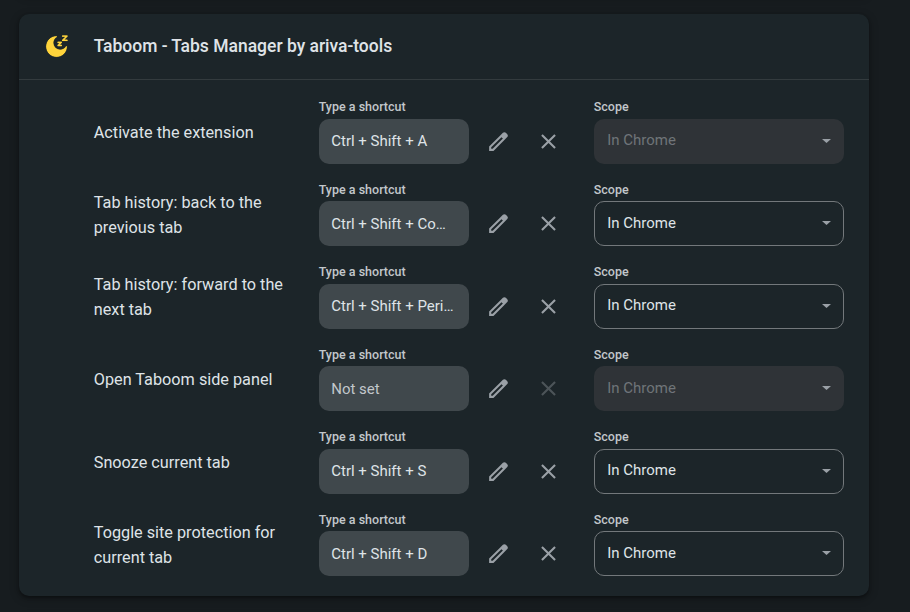

# Using Taboom - Tabs Manager

## Concepts

| Term | Meaning |
|---|---|
| **Snoozed** | Tab discarded from memory via `chrome.tabs.discard()`. Stays in the tab strip; Chrome reloads it when you click it. |
| **Protected** | Site excluded from automatic snoozing (and marked `autoDiscardable: false` so Chrome's own Memory Saver skips it too). |
| **Awake** | Open tab that is not discarded. |

Snoozing never closes tabs. Closing only happens when you explicitly close.

**Seeing snoozed state in Chrome's own tab strip:** extensions cannot style the native tab strip. Enable Chrome's indicator instead: `chrome://settings/performance` → turn on **Memory Saver** — discarded tabs get a dotted ring around their favicon and a hover card.

## Verifying memory is actually freed

Snoozing uses `chrome.tabs.discard()` — Chrome kills the tab's renderer process, the same thing Memory Saver does. To see it with your own eyes:

### Chrome Task Manager (simplest)

1. Open a memory-heavy page (YouTube, Gmail, Figma…), let it load.
2. Press `Shift+Esc` (or Menu → More tools → Task Manager). Find the row `Tab: <page title>` and note its **Memory footprint** — often 100–500 MB.
3. Snooze the tab from Taboom - Tabs Manager.
4. The row **disappears from Task Manager** — the renderer process is gone; that memory is returned to the OS. The tab itself stays in the tab strip.
5. Click the tab → the row reappears as it reloads.

### chrome://discards (detailed)

1. Open `chrome://discards`.
2. Table lists every tab: **Discarded** column shows ✔ for snoozed tabs, plus last-active time. Sanity-check that Taboom - Tabs Manager's Snoozed filter agrees with this table.

### OS level (optional)

Watch total Chrome memory in the system monitor (`htop`, Activity Monitor, Windows Task Manager) while bulk-snoozing dozens of tabs — totals drop within seconds as renderer processes exit.

### What NOT to expect

- The tab-strip **hover card can lie**: it shows a cached screenshot and a stale "Memory usage" number sampled before the discard, and Chrome only shows the "Inactive tab — freed up X MB" treatment for its own Memory Saver discards, not extension discards. Trust Task Manager / `chrome://discards`, not the hover card.
- Savings per tab vary wildly — a static article costs little; a web app costs hundreds of MB. The extension deliberately shows counts, not "MB saved" — Chrome gives extensions no reliable per-tab memory API.
- The snoozed tab's scroll position and form state may be lost on reload — that's why protection rules exist for state-heavy sites.

## Side panel (main UI)

Open by clicking the Taboom toolbar icon, or `Ctrl+Shift+Space`.

Panel position (left or right) is a global Chrome setting: `chrome://settings/appearance` → **Side panel**. Extensions cannot set it, and top/bottom docking does not exist for side panels.

- **Search** — focused on open; matches title, URL, and hostname; multiple words all must match (`github rust`).
- **Filters** — All / Awake / Snoozed / Protected, with live counts.
- **Scope & sort** — current window vs all windows; recent / oldest / title / domain.
- **Row click** — focuses the window and activates the tab (snoozed tabs reload).
- **Visual states** — each window's active tab has an accent left edge + bold title; snoozed tabs are dimmed with a ⏸ title prefix and `SNOOZED` badge.
- **Hover actions** — ⏸ snooze, 🛡 protect/unprotect site, ✕ close.
- **Checkboxes** — select several tabs, then bulk Snooze / Protect / Close from the bottom bar. Closing more than one tab asks for confirmation.
- **Select all** — checkbox left of the scope selector selects/unselects every tab currently shown (i.e. matching the active search and filter). Search first, select all, then bulk-act.

Keyboard: `/` focus search · `↑`/`↓` move selection · `Enter` activate · `Esc` clear search.

Tab history works from any tab, no panel needed: `Ctrl+Shift+,` back · `Ctrl+Shift+.` forward (`Cmd` on Mac). Same trail as the panel's ◀ ▶ buttons and the History context menu. When the active tab changes outside the panel (these shortcuts, Ctrl+Tab, a click in the tab strip), the open panel scrolls just enough to show the new current row.

### Changing the key bindings

The browser-wide shortcuts are Chrome commands, so you change them in Chrome, not in Taboom's options: open `chrome://extensions/shortcuts`, find **Taboom - Tabs Manager**, click the pencil next to a command and press the new combination. Taboom registers five commands — open side panel, tab history back, tab history forward, snooze current tab, toggle site protection — and Chrome adds its own "Activate the extension" row (the toolbar-icon click). Snooze and toggle protection ship unassigned; give them a key here. Chrome rejects keys another extension already uses, and a shortcut set to "In Chrome" works only while a Chrome window is focused ("Global" works everywhere). The in-panel keys (`/`, arrows, `Enter`, `Esc`) are fixed.

## Automatic snooze

Every 5 minutes (configurable) the extension discards tabs that are **all** of:

- inactive longer than the threshold (default 60 minutes, from Chrome's own `lastAccessed`),
- not the active tab, not already snoozed,
- not pinned (default), not playing audio (default),
- not on a protected site, not kept alive,
- a normal `http(s)`/`file` page (Chrome internal pages are never touched).

Additionally, each window keeps at least 2 awake tabs (configurable, 0 = no limit) — oldest eligible tabs are snoozed first, so a window never ends up fully discarded.

Toggle and tune everything in **Settings** (⚙ in the side panel, or the extension's Options page).

## Protecting sites

- Side panel: 🛡 on any row.
- Right-click a page → Taboom - Tabs Manager → **Protect site**.
- Settings page: add rules manually.

Rule forms: `mail.google.com` (exact host), `*.github.com` (domain incl. subdomains) or a full address like `https://app.example.com/board` (that one page only — side panel row menu **Protect URL**). **Unprotect** on a tab removes whichever rules cover it. Protect sites that lose state on reload: editors, admin consoles, forms, terminals, conferencing.

## Keeping tabs alive

Some websites have short sessions: a bank, an intranet or an admin console logs you out after a few idle minutes, and a dashboard stops updating once its tab sleeps. Opening the tab later means logging in again or staring at stale numbers. Marking such a tab as *kept alive* reloads it on a timer, so the session is renewed before it expires and the page stays fresh. Protection only stops the snooze; keep-alive also reloads the page.

1. It is on out of the box: **Settings → Keep Tabs Alive → Keep marked tabs alive** (nothing happens until you mark a tab; untick it to switch the whole feature off).
2. Pick the **Default value** interval (1–90 minutes, default 20). It is copied onto each tab you mark from then on; changing it later leaves existing marks alone.
3. Mark a tab: right-click the page → **Taboom - Tabs Manager → Keep this tab alive** (a checkbox — click again to unmark), or the side panel row menu → **Keep alive**. The same menu then shows one toggle for the mark's state — **Disable keep alive** (pauses the reloads, the mark stays) or **Enable keep alive** — plus **Remove keep-alive mark**. These items only appear for a single tab: with several tabs selected the row menu hides them, so one click can never mark a whole selection for periodic reloads (unmark many at once from the Settings table).

Marked pages reload every interval ± 55 seconds (random, so many tabs do not reload at once) and are never auto-snoozed. The Settings table lists every mark, numbered, with a checkbox to pause / resume its reloads (a paused mark stays listed and still counts as kept), its own **Reload each** interval (changing it restarts the timer), a live **Next reload** countdown and a **Remove** button. Under the table, an **Add** row marks a page by its address without opening it (like Protected Sites): type `https://app.example.com/board` or just `app.example.com/board` (https assumed), click **Add** — the mark takes the current **Default value**, shows the hostname as its title until a tab on that page reports one, and starts reloading as soon as such a tab is open. Only `http`, `https` and `file` addresses are accepted; an address already marked is ignored. The quick launch (▦) gains an **Alive** view with one row per mark, in the same order as Settings: click an open one to jump to it; a mark whose page is not open anywhere (tab closed, or it navigated on) is struck through with *not open*; click opens it in a new tab, and its ⋯ / right-click menu offers **Open**, the same Enable / Disable toggle and **Remove keep-alive mark**.

Marks are kept by page address (without `#fragment`), so they survive a browser restart and apply to every tab on that address; a tab that navigates elsewhere is no longer kept. A page with unsaved form data may show Chrome's "Leave site?" prompt on each reload — do not mark those. No extra permission is needed: reloading a tab is free, the timer is the existing `alarms` permission.

### How a mark works, by example

A mark is **not** a tab id and **not** a window: it is the page address with the `#fragment` dropped, plus its own interval, an optional pause and the time of the next reload.

1. **Marking.** Right-click a tab on `https://dash.example.com/board#tab=2` → **Keep this tab alive**. Taboom stores `https://dash.example.com/board` with the current **Default value** (say 20 minutes) and a next reload time 20 minutes ± 55 seconds from now. The tab's id is not stored.
2. **Reloading.** Every 30 seconds a sweep looks for marks whose time has come and that are not paused. For each one it reloads **every** tab, in every window, whose address (without fragment) matches, then schedules the next reload: interval ± 55 seconds again. Marks whose time has not come are untouched.
3. **Two tabs, one mark.** The board is open in two windows → both reload together. Close one → the other keeps reloading. Close both → the mark stays in the Settings table and in the Alive view (as *not open*), quietly waiting; open the board again tomorrow and it is kept without re-marking.
4. **Navigating away.** The board tab goes to `https://news.ycombinator.com/` → that tab is no longer kept (the context-menu checkbox clears); the board mark still exists for any tab that returns to that address.
5. **Same page or not?** `board#tab=2` and `board#tab=5` are the same mark. `board?view=5` is a different page and needs its own mark (only the fragment is dropped right now (it may change in the future), the query stays).
6. **Interval per mark.** Default 1 minute, mark the board → the board reloads every minute. Raise the default to 25 → the board stays at 1; the next page you mark gets 25. Change the board's own dropdown to 10 → its timer restarts and the countdown shows about 10:00 +/- 55s.
7. **Pausing.** Untick the row's checkbox → the sweep skips it and the countdown reads **paused**; the page is still a mark (menu checkbox stays ticked, still never auto-snoozed) but its row loses the **kept alive** badge and the Alive view greys it out with "paused". The side panel row menu (also from the Alive view) shows **Disable keep alive** while running and **Enable keep alive** while paused — never both. Ticking or unticking restarts that mark's timer from now, so a reload that fell due while paused does not fire at once.
8. **Switching off.** **Keep marked tabs alive** unticked, or an empty table → no timer, no reloads, no menu item. The marks stay in storage; ticking **Keep marked tabs alive** again restarts every mark's timer from now.

The ± 55 seconds is random per reload so that ten dashboards on the same interval do not all reload in the same second.

### Protected vs. kept alive

Both keep automatic snooze away from a page; they differ in what else happens. Pick one; a page can also be both (the side panel row then shows both badges).

| | Protected | Kept alive |
|---|---|---|
| Automatic snooze | never | never |
| Manual snooze (row ⏸, bulk bar) | still works | still works |
| Reloads the page | no — the page is left exactly as it is | yes, every interval ± 55 s |
| Matches | site rules: a host, `*.domain`, or one exact address | one exact address (without `#fragment`) |
| Good for | pages that lose state on reload: editors, forms, terminals, calls | pages that must stay loaded *and* fresh: dashboards, sessions that time out |
| Row indicator | shield button + green **protected** badge | green **kept alive** badge |
| Where to manage | Settings → Protected Sites | Settings → Keep Tabs Alive |

Rule of thumb: protect what would break if reloaded; keep alive what would go stale or log you out if it were not.

## Context menu

Right-click any page → **Taboom - Tabs Manager**: Snooze this tab · Protect site · Keep this tab alive · Snooze all inactive tabs.

## Privacy

Everything runs locally: no server, no telemetry, no content scripts, no host permissions. **Settings → Delete all Extensions data** wipes stored settings and rules.
